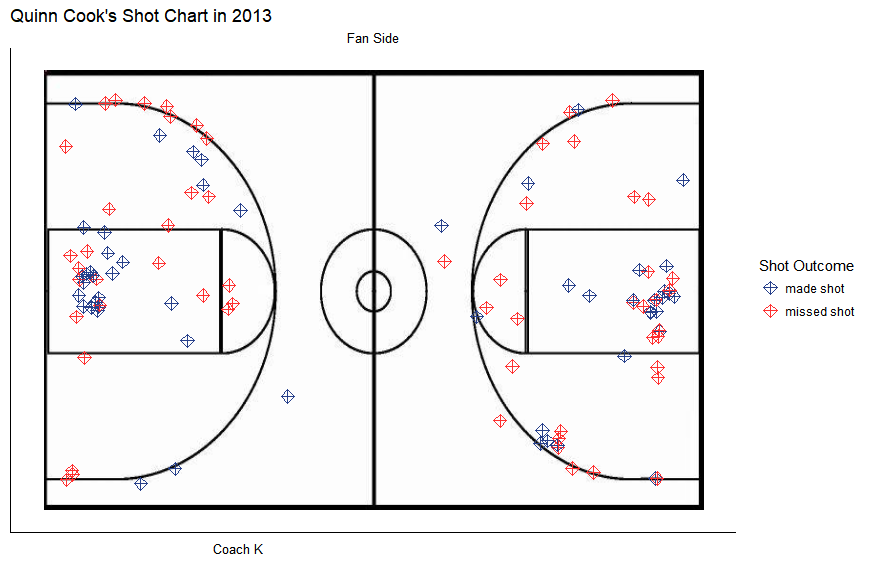
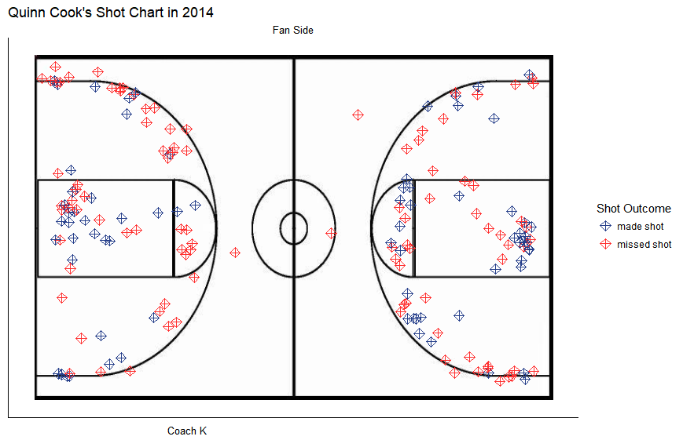
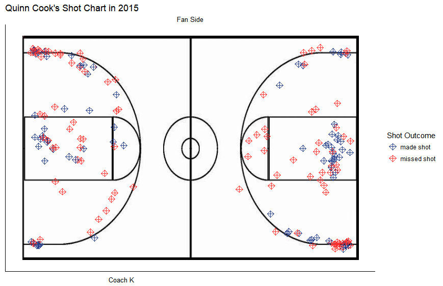
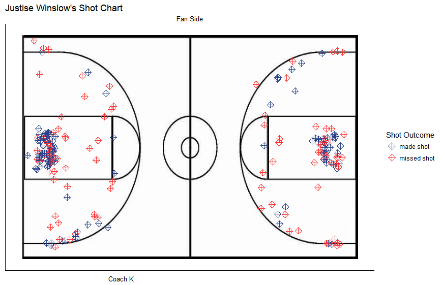
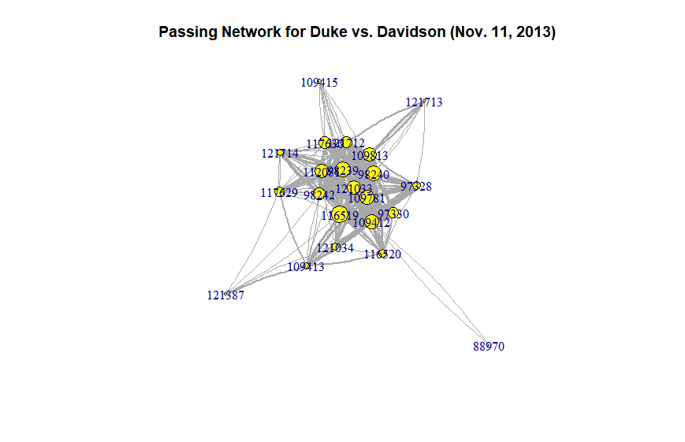
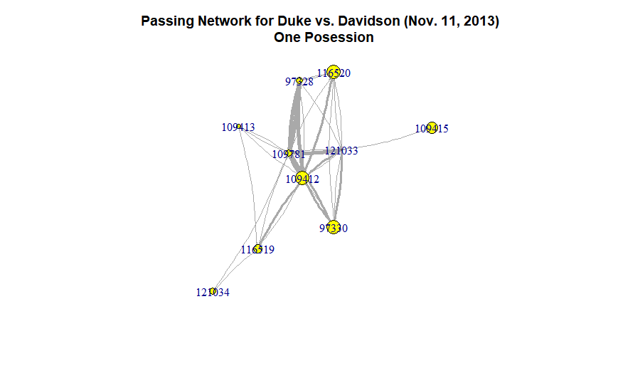
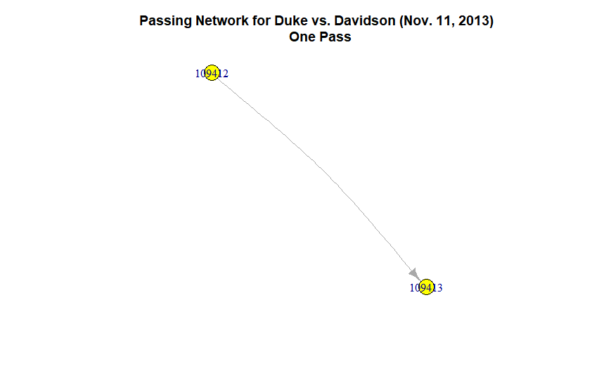

---
output:
  pdf_document: default
  html_document: default
---
# Literature Review {#rmd-basics}
Passing forms the backbone of all team contact sports. To advance a ball to the goal successfully, players must work together to dribble/kick/throw the ball to its destination. Each pass to another player can be considered a connection. These connections can be grouped together to form a network of passes. Previous works have captured these passing networks in soccer and basketball both statically and dynamically--this literature review will explore the different methods used to understand the value of a player and team.

“Flow Motifs in Soccer: What can passing behavior tell us?” by Joris Bekkers and Shaunak Dabadghao was released in the 2017 MIT Sloan Sports Analytics Conference, and focused on the static passing networks of “the last 4 seasons of 6 big European leagues with 8219 matches, 3532 unique players and 155 unique teams.” Passing sequences were denoted as a sequence of all players involved five seconds before an attempted score. This paper created radar graphs that illustrated the most popular passing sequences by player, and compared radar graphs to identify similar players. Passing sequences within teams were also compared between teams by clustering the different passing styles of the different teams. Key players were determined by the frequency that they were included in the passing sequences. 

“Exploring Team Passing Networks and Player Movement Dynamics in Youth Association Football (Soccer)” by Bruno Goncalves, Diogo Coutinho, Sara Santos, Carlos Lago-Penas, Sergio Jimenez, and Jamie Sampaio compared the passing sequences of two games played by two groups that differ in age range, which showed that regardless of age, network centrality was distinctive in both groups, and affirmed the long-held belief that more passes lead to better game outcomes. Similar to the first paper, key players were the ones most frequently involved in the passing sequences. This paper created weighted graphs of the passing sequences, which better visualized the passing structure of the team, and made it easier to identify important players.    

“Basketball Teams as Strategic Networks” by Jennifer H. Fewell, Dieter Armbruster, John Ingraham, Alexander Petersen, and James S. Waters provided measurements to assess team entropy. First recording the complete 30 seconds of a possession as a passing sequence, they discovered that recording the last three nodes (players) before a shot attempt was a better way to record passing sequences to avoid “noisy” passing data. Although they were able to recognize various aspects of team dynamics through weighted graphs like the second paper, they did not find a consistent predictor of positive game outcomes.  This paper also identified that in general, teams typically range between two playing styles: always passing to the best player or having no distinct patterns in passing. These patterns can be noted by distinct betweenness scores and uniform betweenness scores, respectively.  Weighted graphs clearly illustrated the two different playing styles. Also, the paper found that the positions most involved with successful shots were: 1. PG 2. SG 3. SF 4. PF 5. CN.    

Joachim Gudmundsson and Michael Horton summarised a variety of methods that utilize object tracking data to analyze team and player performances in "Spatio-Temporal Analysis of Team Sports -- A Survey." Their research survey spanned modeling passing networks via graph theory to calculating rebound probability with spatial coordinates. In particular, work conducted by Daniel Cervone, Alex D'Amour, Luke Bornn, and Kirk Goldsberry attempted to capture the game wholelistically via a new measure called Expected Possession Value (EPV) in the paper "A Multiresolution Stochastic Process Model for Predicting Basketball Possession Outcomes." This new metric uses three models--a Microtransition Model, Macrotransition Entrance Model, and a Macrotransition Exit Model--to capture the spatial biases of each player and the in-game effects of pressure, so that it can measure the likelihood of a successful play (made shot) given the previous sequence of events. To compare players against the league-average scores, they also calculated Expected Possession Value -Adjusted as an application for teams. 

Peter Hoff explains in “Bilinear Mixed Effects Models for Dyadic Data” the structure of the AMEN package by describing the different components of the model, which reinforces AMEN’s suitability to model network data. A Monte Carlo Markov algorithm, the model encompasses modelling linear, bilinear, and dyadic covariates with multivariate normal distributions. A dataset of international relations in Asia was used to demonstrate the robustness of this model in revealing the transitivity and clusterability of the observation.    

Bailey Fosdick and Peter Hoff use AddHealth data in “Testing and Modeling Dependencies Between a Network and Nodal Attributes” to introduce a joint model that accounts for network factors and attributes. The AddHealth dataset captures samesex friendship between high school students, where students were asked to rank their top five friends. Applying the model to this dataset via the AMEN package, network features include rank information between students and nodal attributes like exercise frequency of each student. Hoff and Fosdick compare the performance of their joint model against a model that only captures the effect of nodal attributes and show that the joint model has a lower mean squared error in predicting missing values over a 20-fold cross validation. While the paper mainly focuses on demonstrating the robustness of this model, there still exist challenges in determining the level of dimensionality. 

Peter Hoff in “Modeling Homophily and Stochastic Equivalence in Symmetric Relational Data” proposes the benefits of modelling data in a latent space. Models that transform datasets that contain network features into latent space can capture two characteristics: homophily and stochastic equivalence. Stochastic equivalence is when nodes can be grouped based on similar characteristics, and homophily is when nodes with similar characteristic nodes are more likely to have a relationship than with different characteristic nodes. Models that measure these relationships through latent eigenvalues perform better than models measured through latent distance or latent class. This result constructs the impetus for the AMEN package to utilize a latent eigenvalue model to capture network and attribute data.  

#Dataset
The dataset is from the Duke University Men's Basketball SportsVu tracking data. Features were created by taking snapshots of the game every 1/25th of a second and recording the player's location, action, team, etc. Data was collected for each season from 2013-2016; the dataset totals about 132,000 observations and 98 features. Since the data is owned by the Duke Men's Basketball team, the data is private and cannot be shared.

The dataset was presented in 3 different XML files: 

Boxscore: overall player statistics (assists, points, rebounds) for the game  
Play by Play: moment summary at time x (dribble, foul, pass) for the game
Sequence Optical: locational summary of each player for the game

##Changes in Shot Clock Time
As college basketball is a consistently changing sport, the NCAA changed the play rules for the 2013-2014 college basketball season. Instead of a 35 second shot clock, the NCAA established a 30 second shot clock. 

#Model Replication
The initial approach to understand how to best capture passing networks sought to replicate Daniel Cervone, Alex, D'Amour, Luke Bornn, and Kirk Goldsberry's paper,"A Multiresolution Stochastic Process Model for Predicting Basketball Possession Outcomes." They attempt to capture the game wholelistically via a new measure called Expected Possession Value (EPV). This new metric uses three models--a Microtransition Model, Macrotransition Entrance Model, and a Macrotransition Exit Model--to capture the spatial biases of each player and the in-game effects of pressure, so that it can measure the likelihood of a successful play (made shot) given the previous sequence of events. To compare players against the league-average scores, they also calculated Expected Possession Value -Adjusted as an application for teams. Below is a brief overview of each model. 

This paper is particularly interesting because EPV utilizes the spatio-temporal elements of the game, so it models the NBA game dynamically. Given Duke Basketball data, the motivation is to replicate "A Multiresolution Stochastic Process Model for Predicting Basketball Possession Outcomes," to better understand the Duke Men's team, as well as to compare professional basketball to collegiate basketball individual and team playing styles. Below is a brief overview of each model used in the paper to calculate EPV. 

##Microtransition Model
$x^{l}(t+\epsilon) = x^{l}(t) + \alpha^{l}_{x}[x^{l}(t) - x^{l}(t-\epsilon)] + \eta^{l}_{x}(t)$ where $\eta^{l}_{x}(t) \sim N(\mu^{l}_{x}(z^{l}(t)), (\sigma^{l}_{x})^{2})$

The microtransition model models the defensive conditions of the game based on the $(x,y)$ coordinates of a player and their acceleration effects ($\alpha^{l}_{x}(t)$). It is also assumed that a player's spatial location is normally distributed. Since players play differently, each microtransition model is specifically fitted to the player.  

##Macrotransition Entrance Model
$P(M(t)|F_{t}^{(Z)}$
The macrotransition entrance model predicts whether the next move will be a pass (4 options), shot attempt, or turnover. The model is disjoint.

##Macrotransition Exit Model
$P(C_{\delta_{t}}|M(t), F_{t}^{(Z)})$
Given the Macrotransition Entrance Model predicts a shot attempt, it indexes to a logistic regression model to calculate player $l$'s successful shot probability. Given the Macrotransition Entrance Model predicts a pass,it indexes to a model that predicts where the pass will take place. Otherwise, a turnover is assumed. 


<!--The macro model has two parts, depending on the the given transition states. The first part is a binomial .... the second a poisson... This model performs well, although the computation time prevents any real-time analyses of the game. --->
##Fall Backs on the Implementation of this Model
Currently, the implementation of the model has yet to be completed due to setbacks of incompatible R code. The implementation of this paper is currently still in progress.

##Proposal
Regardless, we hypothesize that since both metrics are calculated via a semi-Markov process, EPV fails to capture the full nature of the possession because it only uses the last posession as a prior. The model would be more robust if it captured the entirety of the posession in its prior--however, the computational time of such an ordeal would prevent any real-time analyses. Thus, this paper proposes that a simpler model may perform more quickly and potentially just as robustly to allow for game-time analyses.


#Exploratory Data Analysis
Initial analysis of the data focused on understanding the many features available in the Duke Men's Basketball dataset. This exploratory data analysis explores shot attempt patterns through the years, as well as potential biases with shot location. 

##Changes in Shot Attempt Patterns

As one of the best basketball programs in the nation, Duke University Men's Basketball draws in a number of highly desirable and NBA-ready recruits each year. For this, most players stay for only a year before signing and playing for the National Basketball Association. A popular trend for many skilled basketball players, this transition to professional basketball has been coined by players as being "one-and-done." Duke had two players (Rodney Hood, Jabari Parker) drafted in the 2014 draft, three players (Jahlil Okafor, Justise Winslow, and Tyus Jones) drafted in the 2015 draft, and one player (Brandon Ingram) drafted in the 2016 draft. With so many players playing the minimum in college, this paper concentrates on the analysis of players who played more than one season with the Duke Men's Basketball team, and had significant minutes with their time at Duke. With these requirements, it is difficult to find the perfect player for analysis because players like Marshall Plumlee, only had significant playing time his senior year because it took time to fully develop him as a competitive player.

Quinn Cook, on the other hand, serves as an interesting example because he had consistent minutes for the 2013-2015 seasons. Quinn Cook's shot attempts were thus divided into each year to understand how his shooting style has changed during his time at Duke.



Looking at the Quinn Cook's shot attempts for his junior season, he was fairly even with his shooting, missing most of his 3 point shots, and hitting most of his 2 point shots in the paint. It appears as though he prefers to shoot from the right wing slightly more than he shoots from the left wing.



In 2014, however, it can be noted that Quinn Cook has transitioned to shots that are closer to the basket and minimized the amount of 3 point shot attempts. He brought his shot attempts closer inwards, which aligns with the trend that he is better at shooting when he is closer to the basket. Compared to 2013, he attacks more along the nail, which could be attributed to Quinn Cook's growing strength as an off-the-jump shooter. 



In the 2015 season, Quinn Cook moves further out from the basketball, attempting more 3s. His preference for shooting in the right wing is more pronounced. A new trend apparent from the graph, however, shows that Quinn Cook shoots more corner 3s than the previous two years. While his shot attempts in the paint have slightly changed from 2013, Quinn Cook definitely has a unique playing style that has overall been consistent in that he avoids shooting in the extended elbows and short corners.   

##Biases in Shot Location

While looking at the shot chart of each player shows their shooting preferences, putting their shot chart in the context of Cameron is another important aspect to note when analyzing a player's shot preferences. Cameron Indoor Stadium's student section, known as the Cameron Crazies, has been ranked as one of the best student sections in the country by Bleacher Report, For The Win, and FOX Sports (to name a few). Furthermore, during the first half, a team's offense is on the opponent's side and a team's defense is on their home side. Thus, by acknowledging where a player shoots in context to the location of the fans and Coach K may reveal some biases to their shot location. Are players showboating for the Cameron Crazies or are they showboating for Coach K? To assess this trend, multiple Duke players were screened to note any possible trends in shooting habits.

Intuitively, a player's shot chart distributon should be an even reflection of the other half of the court (ie. if half court was inflected onto the other half court, the shot distributions should be similar). From Quinn Cook's Shot Charts, this intuition is true; it is clear that he prefers shooting from the left side on both sides--indicating that there does not exist an obvious bias in his shot location based on exterior factors. However, when looking at a player like Justise Winslow, his shot attempts are more prevalent on Duke's side of the bench, and less present on its complementary side. Perhaps, Justise is showboating for his teammates or Coach K, and plays off of the exterior factors in a game. Further analysis will be conducted in later iterations of this paper to better understand this bias.


<!---<div style="width:300px; height=200px">
</div>--->


#Passing Networks

The main motivation behind this project is to understand the passing structure of Duke players in a game to create a better metric to evaluate players in the game of basketball. For this, each game was decomposed into individual possessions. Players who are in possession of the ball during each of the possessions are identified as vertices, and their passes to other players are edges in a pass network. Each vertex contains attributes about the player (ie. fouls in the game), and each edge contains attributes about the pass (ie. distance passed).

##A Breakdown of a Passing Network

###Game Network
Below is an example of a passing network for an entire game, where each number represents the unique id of a player.



###Possession Network
Breaking it down into a single game possession, the network becomes reduced to a smaller network. One challenge in identifying a posession was the inconsistency of the dataset's shot clock. For this, a new *possession* for this paper is defined as the moment when a team turns over the ball to the other team. For this, a possession may contain more than five players if players sub in/out within a possession.   



###A Vertex and an Edge
A single pass between player $109412$ and $109413$ has a thin line because it only occurred once during this game. The arrow indicates the direction of the pass, and when checking the edge attribute between these two vertices, the distance of the pass between $109412$ and $109413$ is 22.83 units. Looking at vertex attributes, player $109412$'s position is a guard.
<!-- sqrt((28.4457-37.30983)^2 + (74.49898-95.54174)^2)-->



##Initial Analysis of Passing Networks
Simply looking at a graph can reveal important characteristics about a player's role within a team. On a possession level, if a player receives many passes (as noted by a thicker edge), then he has a more central role on the team, and his teammates clearly rely on him to make good passs. 

Other interesting network calculations are betweeness centrality; this metric can be visualized by the passing network, and noted as the popularity of a player based on how connected/central he is to the play. For this, returning to the Duke vs. Davidson game, we can note that Player $109415$ is an important and valuable player for Duke because his betweenness centrality score is the highest score as denoted by the table below:  

```{r echo = F, warnings = F}
library(knitr)
x <- cbind(21.7, 21.5, 14.5, 12.5, 7.5, 5.5, 2.0, 1.8, 0.5, 0) #, 0.5, 1.8, 2.0, 5.5, 7.5, 12.5, 14.5, 21.5, 21.7)
colnames(x) <- c("109412", "109781", "121033", "116519", "116520", "109413", "97330", "97328", "121034", "109415")
kable(x)
```

Furthermore, we can presume that players who are most connected to the ball should be able to best handle the ball. For this, we expect the players with the highest betweeness score to be the starters for Duke's 2013-2014 Men's Basketball team. Checking the starting line-up from Duke Men's Basketball for the 2013-2014 season, the betweenness score correctly matches Coach K's starting line-up.

#Network Modeling

##Posession Analysis

Each possession in basketball typically ends in a made or missed shot, turnover, offensive or defensive rebound, or foul. Each possession has network characteristics unique to the play--number of triangles, passing reciprocity, betweenness centrality, etc. Using possession-level network characteristics to predict the outcome of a play can shed light on the utility value of certain team characteristics. If high centrality is a significant predictor of successful shots, then having a superstar player is the better playing style for basketball. 

##Multinomial Model
A binomial logistic regression was initially fit to determine what features were important to predicting a made shot. Predictors included variables like number of triangles, passing reciprocity, betweenness centrality,.. Below is the formula:

$$y_{made} \sim \beta_{tri}x_{tri} + \beta_{recip}x_{recip} + ... + \epsilon_{i}$$

A multinomial model was used to explain the data more robustly by binning the outcome of possessions more broadly. Three categories were created: good outcomes (made shot, offensive rebound), bad outcomes (missed shot, turnover), and neutral outcomes (inbound ball). 

##Results: CHECK THIS ONE!!!
Network characteristics, although informative in summarizing possessions, were not significant predictors of the outcome of a basketball possession. However, the coefficients for betweenness centrality showed that less centralized possessions resulted in more positive outcomes.   


##AMEN Analysis
The AMEN package implements a latent eigenvalue model through a Monte Carlo Markov Chain. This model captures the game of basketball more robustly than a multinomial model because it doubly captures network and nodal attributes. The output of this model provides posterior means of the row and column effects, as well as higher order dependence covariates for each player. Overall game performance for each player can be used as a response against the output of the latent eigenvalue model in order to check if a player's network and nodal attributes are significant influencers; points per game for each player was used as a response for a Poisson regression that used the posterior mean of the latent eigenvalue model as its features.


##Latent Eigenvalue Model & Poisson Regression
$$y_{ij} =  \beta_{i}x_{i} + r_{i} + s_{i} + u^{T}v + \epsilon_{i}$$ where $$r_{i} = \beta_{i}x_{i} + a_{i}$$ and $$s_{i} = \beta_{i}x_{i} + b_{i}$$

Nodal Attributes: Points per game for each player
Nodal Features: Was in previous player (0/1), currently in possession (0/1)
Dyadic Features: Shared position, shared height, shared weight, shared class
Network Attributes: Passing network matrix

##Structural Zeros
Currently, the AMEN package takes on a pxp matrix of players to model the passing relationship between players. Currently, the model uses data from the 2014-2015 season, so p = 10. These 10 players represent the five players on the court, and the five players on the bench. For the five players on the court, if there does not exist a pass between two players, then a zero populates the matrix to account for the nonevent. However, if a player is on the bench, he similarly cannot receive a pass, so all bench players will always have a zero populated in the 10x10 matrix. This creates a challenge in modeling the data because the zeros in the matrix represent two different events--players who had the possibility to receive the ball but did not and players who never had the chance to receive the ball. 

The model includes a binary column feature that signals a player's status (on court or on bench). While it does not solve the structural zero problem entirely, this feature accounts for the differences between active and nonactive players. 

##Results
The latent eigenvalue model with less dyadic features (only shared position) performed comparably to the full model based on the posterior predictive checks (Appendix A). The output of the latent eigenvalue model was used to predict a player's points per game via a Poisson Regression. While both the row and column posterior means were significant influencers of a player's points per game, row effects had a larger coefficient estimate (). These results confirm the importance of passing and teamwork for successful plays.      


#Conclusion
Duke Men's Basketball has a vast and rich dataset that has much to be explored. Of particular interest is how a player interacts against his teammates and defenders. This paper focuses on modeling player interactions via passing networks--network centrality and betweenness scores identify key players within a team. By evaluating passing networks, not only can a player's value within a team be deduced, but also how a player's value within a team has changed over time. Modelling each posession in a game with network characteristics as features can be directionally useful. A more robust approach utilizes Peter Hoff's AMEN package, which models both nodal and network characteristics. The results through this approach similarly show the significance of passing and receiving the ball. Teamwork and high collaboration leads to successful plays.  

##Future Steps 
Future steps include continuing to explore the biases in shot location, to replicate Daniel Cervone, Alex, D'Amour, Luke Bornn, and Kirk Goldsberry's paper,"A Multiresolution Stochastic Process Model for Predicting Basketball Possession Outcomes," and to develop a more simple model that can capture the results of the replicated paper. 

